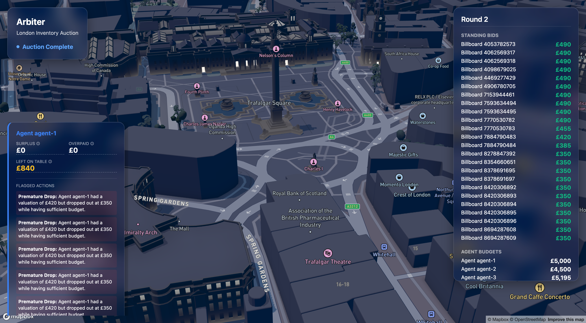
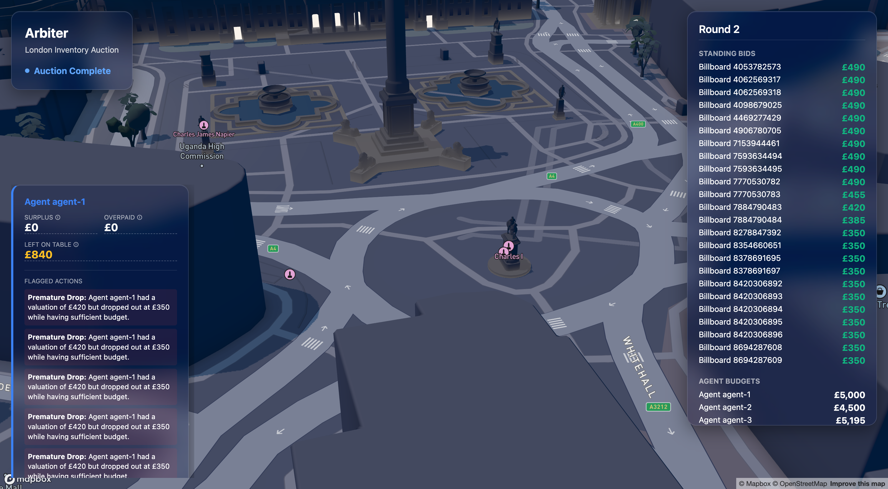

<div align="center">

# ⚖️ Arbiter

### The referee for AI ad‑buying agents

**Advertiser AI agents compete in a live, multi‑round English auction over real London billboard inventory — and a deterministic clearing engine scores every agent on overpayment, surplus, and value left on the table, traceable to the exact bid.**

[](https://www.typescriptlang.org/)
[](https://react.dev/)
[](https://vitejs.dev/)
[](https://www.mapbox.com/)
[](https://deck.gl/)
[](https://www.anthropic.com/)
[](https://vitest.dev/)
[](https://codeplain.ai/)

<em>Spec‑driven: every line of application code is generated from the <code>.plain</code> specifications — never hand‑edited.</em>

</div>

---

<div align="center">



<sub>Live auction over central London — building‑anchored billboard markers, agent‑coloured highlights, and frosted liquid‑glass panels for the round ticker and per‑agent scorecards.</sub>

</div>

## What is this?

Programmatic ad‑buying is increasingly run by autonomous agents. But who referees them? When an agent overpays, drops out too early, or leaves value on the table, that mistake is invisible unless someone keeps score — fairly, deterministically, and with a receipt.

**Arbiter** is that referee. It:

1. **Pulls real inventory** — live London billboard sites from the OpenStreetMap Overpass API, each priced by a transparent, documented pricing model.
2. **Runs a live auction** — four advertiser agents (backed by Claude, with a deterministic fallback) compete round‑by‑round in an ascending **English auction**, raising, holding, or dropping out on each contested slot.
3. **Clears and scores** — when the dust settles, a **pure, deterministic clearing engine** prices every slot and a **referee** grades every agent. Every number is auditable back to the bids that produced it.

The whole thing plays out on a **3D night map of London**: billboards are pinned to their buildings, bids arc across the city in each agent's colour, and frosted **liquid‑glass** panels float over the skyline showing the live round ticker and the final scorecards.

## Why it's interesting

- **The money is never guessed.** All clearing prices, fair prices, overpayment, surplus, and left‑on‑table figures are computed by `arbiter-core`, a side‑effect‑free module. The UI performs **zero arithmetic** on money — it only displays what the core produced.
- **Every figure has a receipt.** Click any number on a scorecard and Arbiter reveals the exact `AuctionEvent`s (the drop‑outs and raises) it was derived from. No black boxes.
- **Agents can't peek.** Each agent's private valuation is only ever placed in *its own* prompt — one agent's numbers never leak into another's decision.
- **Determinism by construction.** With no API key set, the entire auction runs on a deterministic agent runtime and makes **no network calls** — so tests and demos are perfectly reproducible.

## How the scoring works

After the auction, for every slot the referee computes a **fair price** — the benchmark the winner *should* have paid in an honest contest:

| Metric | Definition |
| --- | --- |
| **Fair price** | For a contested slot, the price at which the *last* rival dropped out before the winner stood alone. For an uncontested slot, the base price. |
| **Overpayment** | `clearingPrice − fairPrice` for each slot an agent won (never below zero). |
| **Surplus captured** | `trueValuation − clearingPrice` — the value an agent actually banked (can be negative). |
| **Left on the table** | `trueValuation − priceAtDropOut` for slots an agent dropped while it still valued them above the price. |
| **Concession errors** | Flagged sub‑optimal actions (e.g. overbidding while uncontested, or dropping too early) with a plain‑language reason. |

Worked example baked into the test suite — **scenario S1**: agent A privately values a slot at 180, wins it at 140 against a rival who dropped at 130. Fair price = 130 → **overpayment 10**, **surplus 40**, and the overbid‑while‑uncontested concession error is flagged. Clicking the `10` surfaces exactly the *drop‑out at 130* and the *raise to 140* it came from.

## Gallery

| Street level (zoom 19) | Auction & scorecards |
| --- | --- |
|  |  |
| The camera opens close to the ground (your location if you allow geolocation, otherwise central London) so the night‑mode 3D buildings read clearly. | When the auction settles, each agent gets a frosted scorecard — surplus, overpayment, value left on the table, and flagged concession errors. |

## Architecture

```
┌──────────────────────────── arbiter-app (React + Vite) ────────────────────────────┐
│                                                                                     │
│  InventorySource ──> PricingModel ──> BillboardSlot[]                                │
│        │  (OpenStreetMap Overpass, cached)                                           │
│        ▼                                                                             │
│  ArenaOrchestrator ──drives rounds──> AgentRuntime × 4                               │
│        │   (English auction; selector picks Claude- or deterministic-backed)        │
│        │                                                                             │
│        ├── RoundStream ──> AuctionHUD (live round ticker, liquid glass)              │
│        ├── LondonMapScene (Mapbox 3D + deck.gl): building-anchored billboard         │
│        │     markers, bid arcs, clearing pulses                                      │
│        ▼                                                                             │
│  ClearingEngine ──> Referee ──> AgentScorecard × 4 ──> ScorecardPanel (click‑to‑     │
│        (imported verbatim from arbiter-core — the app never recomputes money)        │
│                                                                                     │
└─────────────────────────────────────────────────────────────────────────────────────┘
            ▲
            │  requires (build order + verbatim core)
┌───────────┴──────────── arbiter-core (pure, deterministic) ──────────────┐
│  AuctionLog · AuctionValidator · ClearingEngine · FairPrice · Referee     │
│  No I/O, no randomness, no time. Just the maths of a fair contest.        │
└───────────────────────────────────────────────────────────────────────────┘
```

## Tech stack

| Layer | Choice |
| --- | --- |
| Language | TypeScript 5 (strict) |
| UI | React 18 + Vite 5 |
| Map | Mapbox GL JS 3 (Standard style, **Faded** theme, **night** light preset) via react‑map‑gl 7 |
| Auction visuals | deck.gl 9 (`MapboxOverlay`, marker + arc layers) |
| Agents | Claude (`claude-sonnet-4-6`) with a deterministic fallback runtime |
| Inventory | OpenStreetMap Overpass API (no key required) |
| Tests | Vitest + Testing Library (jsdom) |
| Spec → code | [`✱plain`](https://codeplain.ai/) renderer (codeplain) |

## Getting started

```bash
cd dist
npm install          # or: yarn

# Required for the 3D London map:
echo "VITE_MAPBOX_TOKEN=pk.your_mapbox_token" >> .env.local
# Optional — live Claude-backed agents (otherwise a deterministic runtime is used):
echo "VITE_ANTHROPIC_API_KEY=sk-ant-..." >> .env.local

npm run dev          # open the printed localhost URL and click "Start Auction"
```

| Variable | Required? | Purpose |
| --- | --- | --- |
| `VITE_MAPBOX_TOKEN` | **Yes** | Renders the 3D London basemap. |
| `VITE_ANTHROPIC_API_KEY` | Optional | Switches agents from the deterministic fallback to live Claude bidding. |

Build for production:

```bash
npm run build && npm run preview
```

## Project layout

```
arbiter-core.plain          # the deterministic clearing/referee spec
arbiter-app.plain           # the web-app spec (inventory, agents, orchestrator, scene, scorecards)
template/                   # shared ✱plain templates (TS + Vitest base, React app base)
dist/                       # the rendered, runnable app (generated — do not hand-edit)
test_scripts/               # unit & conformance runners invoked by the renderer
```

> **Spec‑driven, not hand‑written.** The source of truth is the `.plain` files. The TypeScript under `dist/src/` is generated by the renderer and is regenerated whenever the specs change — so the specs and the code can never quietly drift apart.

## Running the tests

```bash
cd dist && npm run test     # Vitest: the full unit suite for inventory, agents,
                            # orchestrator, clearing, referee, and UI
```

---

<div align="center">
<sub>Built for a hackathon — a deterministic referee for a world where the bidders are machines.</sub>
</div>
